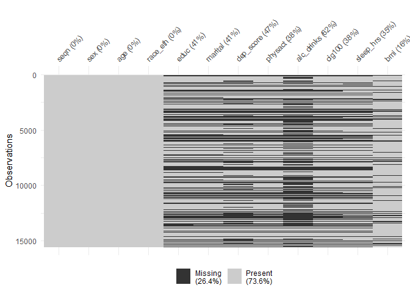
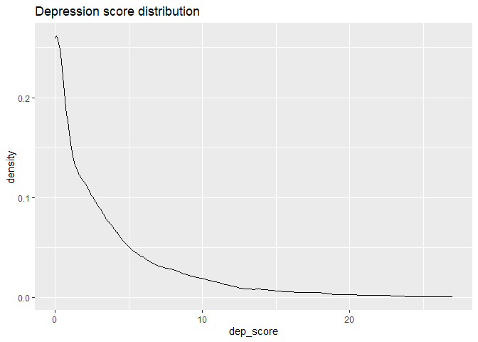
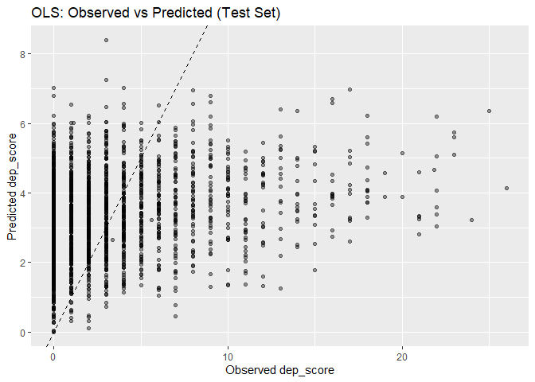

Depression Score Prediction Analysis
================
Toheeb
2025-11-16

- [Context & Goal](#context--goal)
- [Exploratory Data Anlysis](#exploratory-data-anlysis)
  - [Data Import](#data-import)
  - [Compute depression sum score (from the DPQ
    variables)](#compute-depression-sum-score-from-the-dpq-variables)
  - [Demographics — cleaning & factor
    creation](#demographics--cleaning--factor-creation)
  - [Select and clean other variables (physical activity, alcohol,
    smoking, BMI,
    sleep)](#select-and-clean-other-variables-physical-activity-alcohol-smoking-bmi-sleep)
  - [Merge: anchor to demographics using
    `left_join`](#merge-anchor-to-demographics-using-left_join)
  - [Missingness exploration](#missingness-exploration)
  - [Exploratory numeric checks &
    correlation](#exploratory-numeric-checks--correlation)
- [Modeling: consistent pattern for all
  models](#modeling-consistent-pattern-for-all-models)
  - [Model A — OLS on raw outcome (for
    baseline)](#model-a--ols-on-raw-outcome-for-baseline)
    - [Train/test split](#traintest-split)
    - [Recipe: imputation + dummies (applied to training set
      only)](#recipe-imputation--dummies-applied-to-training-set-only)
    - [Model specification & fit (OLS)](#model-specification--fit-ols)
    - [Fit model to the held-out test
      set](#fit-model-to-the-held-out-test-set)
    - [Evaluate model performance](#evaluate-model-performance)
  - [Model B — Box-Cox-Transformed
    Outcome](#model-b--box-cox-transformed-outcome)
    - [Quick summary on Model B: Box-Cox-transformed
      outcome](#quick-summary-on-model-b-box-cox-transformed-outcome)
  - [Model B.2 — Yeo-Johnson-Transformed
    Outcome](#model-b2--yeo-johnson-transformed-outcome)
    - [Quick summary on Model B.2: Yeo–Johnson-transformed
      outcome](#quick-summary-on-model-b2-yeojohnson-transformed-outcome)
  - [Model C — Log-transformed
    Outcome](#model-c--log-transformed-outcome)
    - [Quick summary on Model C: Log-transformed
      outcome](#quick-summary-on-model-c-log-transformed-outcome)
- [Cross-Validation, Regularization, Interpretability, and Final
  Reflection](#cross-validation-regularization-interpretability-and-final-reflection)
  - [Cross-Validation — OLS Stability & Baseline
    Comparison](#cross-validation--ols-stability--baseline-comparison)
  - [Regularized Alternative — Elastic Net
    (`glmnet`)](#regularized-alternative--elastic-net-glmnet)
    - [Final Reflection](#final-reflection)
  - [Reproducibility & Session Info](#reproducibility--session-info)

``` r
if (!requireNamespace("pacman", quietly = TRUE)) install.packages("pacman")

pacman::p_load(
  here, haven, tidyverse, rsample, naniar, skimr, recipes, parsnip, workflows, tune, yardstick, broom, GGally, glmnet, dials, doParallel, car, lmtest, sessioninfo
)
```

``` r
conflicted::conflict_prefer("select", "dplyr")
```

    ## [conflicted] Will prefer dplyr::select over any other package.

``` r
conflicted::conflict_prefer("filter", "dplyr")
```

    ## [conflicted] Will prefer dplyr::filter over any other package.

The `conflicted` package ensures functions from core packages (e.g.,
`dplyr::filter`) are used consistently.

# Context & Goal

This notebook builds and evaluates linear regression models predicting a
depression score derived from DPQ items (PHQ-9 depression scale) in
NHANES 2017-March 2020 data. It is annotated with explanations about
modeling choices, reproducible preprocessing using recipes, diagnostic
checks, and a short example of hyperparameter tuning (elastic net) to
illustrate regularization for predictive modeling.

# Exploratory Data Anlysis

## Data Import

**Note on file paths** — it’s best practice to avoid absolute Windows
paths in notebooks that may be shared. So I place data in `data/` and
use `here::here...`. This allows others to run the notebook without
having to edit paths.

``` r
depression <- read_dta(here::here("data", "depression.dta"))
demographics <- read_dta(here::here("data", "demographics.dta"))
physical_activity <- read_dta(here::here("data", "physical-activity.dta"))
drinking <- read_dta(here::here("data", "alcohol-use.dta"))
smoking <- read_dta(here::here("data", "cigarette-use.dta"))
bmi <- read_xpt(here::here("data", "p_bmx.xpt"))
sleeping <- read_dta(here::here("data", "sleep-disorder.dta"))
```

Quick checks to confirm the ID column has the same name across all data
frames:

``` r
names(depression)[1]; names(demographics)[1]; names(physical_activity)[1]; 
```

    ## [1] "seqn"

    ## [1] "seqn"

    ## [1] "seqn"

``` r
names(drinking)[1]; names(smoking)[1]; names(bmi)[1]; names(sleeping)[1];
```

    ## [1] "seqn"

    ## [1] "seqn"

    ## [1] "SEQN"

    ## [1] "seqn"

The column name is lowercase in all data frames, except `bmi`. So, I fix
this:

``` r
bmi <- bmi %>%
  rename(seqn = SEQN)
```

Next, I check whether each data frame has any duplicate IDs.

``` r
# create a list of the data frames
data_list = list(dep = depression, dem = demographics, phys_act = physical_activity, 
                 drink = drinking, smoking = smoking, bmi = bmi, sleep = sleeping)

# use lapply to find duplicate IDs (seqn) in each data frame
duplicate_IDs <- lapply(data_list, function(df) {
  df %>%
    count(seqn) %>%
    filter(n>1)
})

print(duplicate_IDs)
```

    ## $dep
    ## # A tibble: 0 × 2
    ## # ℹ 2 variables: seqn <dbl>, n <int>
    ## 
    ## $dem
    ## # A tibble: 0 × 2
    ## # ℹ 2 variables: seqn <dbl>, n <int>
    ## 
    ## $phys_act
    ## # A tibble: 0 × 2
    ## # ℹ 2 variables: seqn <dbl>, n <int>
    ## 
    ## $drink
    ## # A tibble: 0 × 2
    ## # ℹ 2 variables: seqn <dbl>, n <int>
    ## 
    ## $smoking
    ## # A tibble: 0 × 2
    ## # ℹ 2 variables: seqn <dbl>, n <int>
    ## 
    ## $bmi
    ## # A tibble: 0 × 2
    ## # ℹ 2 variables: seqn <dbl>, n <int>
    ## 
    ## $sleep
    ## # A tibble: 0 × 2
    ## # ℹ 2 variables: seqn <dbl>, n <int>

## Compute depression sum score (from the DPQ variables)

Click
[here](https://wwwn.cdc.gov/Nchs/Data/Nhanes/Public/2017/DataFiles/DPQ_J.htm#DPQ100)
for description of the DPQ variables. In the following steps, I compute
a summed score from the nine DPQ items.

- 1: select the variables that constitute the depression score (the
  PHQ-9 scale)

``` r
dpq_vars <- c("dpq010","dpq020","dpq030","dpq040","dpq050","dpq060","dpq070","dpq080","dpq090")
```

- 2: recode values 7 (Refused) and 9 (Don’t know) as missing

``` r
depression <- depression %>% 
  mutate(across(all_of(dpq_vars), ~ na_if(.x, 7) %>% 
                  na_if(9)))
```

- 3: check missingness patterns across the 9 items

``` r
# calculate the percentage missingness across the 9 vars
missing_percentage_table <- depression %>%
  summarise(across(all_of(dpq_vars),
                   ~ sum(is.na(.)) / n()*100)) %>%
  tidyr::pivot_longer(
    cols = everything(),
    names_to = "variable",
    values_to = "Percent_Missing"
  )
missing_percentage_table
```

    ## # A tibble: 9 × 2
    ##   variable Percent_Missing
    ##   <chr>              <dbl>
    ## 1 dpq010              7.44
    ## 2 dpq020              7.43
    ## 3 dpq030              7.44
    ## 4 dpq040              7.45
    ## 5 dpq050              7.43
    ## 6 dpq060              7.47
    ## 7 dpq070              7.43
    ## 8 dpq080              7.45
    ## 9 dpq090              7.46

About 7% data is missing per column.

``` r
# calculate the average percentage of missing items per respondent
row_missingness <- depression %>%
  mutate(missing_prop = rowMeans(is.na(across(all_of(dpq_vars))))) %>%
  summarise(avg_row_missingness = mean(missing_prop, na.rm=TRUE) * 100)

row_missingness
```

    ## # A tibble: 1 × 1
    ##   avg_row_missingness
    ##                 <dbl>
    ## 1                7.45

On average, each respondent is missing 7.4% of the 9 items (i.e., ≈0.67
items per respondent).

- 4: Person-mean imputation if \<=2 missing items

``` r
depression_cleaned <- depression %>%
  rowwise() %>%
  mutate(
    dpq_nonmiss = sum(!is.na(c_across(all_of(dpq_vars)))),
    dpq_mean    = mean(c_across(all_of(dpq_vars)), na.rm = TRUE),
    dep_score   = if (dpq_nonmiss >= 7) {     # require at least 7 of 9 items answered
                     sum(replace_na(c_across(all_of(dpq_vars)), dpq_mean))
                   } else {
                     NA_real_
                   }
  ) %>%
  ungroup() %>%
  filter(!is.na(dep_score)) %>% 
  select(seqn, dep_score)
```

Why use person-mean imputation? Following established PHQ-9 scoring
procedures, this approach is suitable when the missingness is below 20%.
Participants with fewer than 3 missing PHQ-9 items had missing values
replaced using individual mean imputation. Cases with 3 or more missing
items were excluded from depression score computation. For more on
person-mean imputation in PHQ-9 scoring, see [Rezvan et
al.,2022](https://pmc.ncbi.nlm.nih.gov/articles/PMC9718541/) and [Shrive
et al.,
2006](https://bmcmedresmethodol.biomedcentral.com/articles/10.1186/1471-2288-6-57).

## Demographics — cleaning & factor creation

Click
[here](https://wwwn.cdc.gov/Nchs/Data/Nhanes/Public/2017/DataFiles/DEMO_J.htm)
for description of the demographic variables. I take the relevant
variables, handle refused/don’t know values, and convert to labeled
factors.

``` r
# Subset variables of interest
demographics <- demographics %>% 
  select(seqn, riagendr, ridageyr, ridreth3, dmdeduc2, dmdmartz)
```

``` r
# Rename to more convenient names
demographics <- demographics %>% 
  rename(sex = riagendr, age = ridageyr, race_eth = ridreth3, educ = dmdeduc2, marital = dmdmartz)
```

``` r
# Recode refused/don't know codes to NA (per codebook)
demographics <- demographics %>% 
  mutate(educ = na_if(educ, 7),
         educ = na_if(educ, 9),
         marital = na_if(marital, 77),
         marital = na_if(marital, 99)
         )
```

``` r
# We map them to compact numeric indices for easier factor creation
race_map <- function(x){
  case_when(
    x == 1 ~ "MexAmerican",
    x == 2 ~ "OtherHispanic",
    x == 3 ~ "NHWhite",
    x == 4 ~ "NHBlack",
    x == 6 ~ "NHAsian",
    x == 7 ~ "Other",
    TRUE ~ NA_character_
  )
  }

demo_recode <- demographics %>% mutate(race_eth = race_map(race_eth))
```

``` r
# Convert to factors with chosen reference levels.
demographics_cleaned <- demo_recode %>% 
  mutate(
    sex = factor(sex, levels = c(1,2), labels = c("M","F")),
    race_eth = factor(race_eth,
                      levels = c("NHWhite","MexAmerican","OtherHispanic","NHBlack","NHAsian","Other")),
    educ = case_when(educ == 1 ~ "<9th", educ == 2 ~ "9-11th", educ == 3 ~ "HS/GED", 
                     educ == 4 ~ "SomeCollege", educ == 5 ~ ">=College", TRUE ~ NA_character_) %>%
      factor(., levels = c("HS/GED","<9th","9-11th","SomeCollege", ">=College")),
    marital = case_when(marital == 1 ~ "Married/LiveWithPartner", marital == 2 ~ "Wid/Div/Sep", 
                        marital == 3 ~ "NeverMarried", TRUE ~ NA_character_) %>%
      factor(., levels = c("Married/LiveWithPartner","Wid/Div/Sep","NeverMarried"))
)
```

Note: the ordering of variable levels in `levels=c(...)` is important,
as the first level will be the reference level when one_hot argument is
set to False (later in the `step_dummy()` function).

``` r
# Quick checks for the cleaned demographics data
sapply(demographics_cleaned, class)
```

    ##      seqn       sex       age  race_eth      educ   marital 
    ## "numeric"  "factor" "numeric"  "factor"  "factor"  "factor"

``` r
head(demographics_cleaned)
```

    ## # A tibble: 6 × 6
    ##     seqn sex     age race_eth      educ        marital     
    ##    <dbl> <fct> <dbl> <fct>         <fct>       <fct>       
    ## 1 109263 M         2 NHAsian       <NA>        <NA>        
    ## 2 109264 F        13 MexAmerican   <NA>        <NA>        
    ## 3 109265 M         2 NHWhite       <NA>        <NA>        
    ## 4 109266 F        29 NHAsian       >=College   NeverMarried
    ## 5 109267 F        21 OtherHispanic SomeCollege NeverMarried
    ## 6 109268 F        18 NHWhite       <NA>        <NA>

``` r
dim(demographics_cleaned)
```

    ## [1] 15560     6

## Select and clean other variables (physical activity, alcohol, smoking, BMI, sleep)

- Physical activity: Click
  [here](https://wwwn.cdc.gov/Nchs/Data/Nhanes/Public/2017/DataFiles/PAQ_J.htm)
  for description of physical activity variables.

``` r
physical_activity <- physical_activity %>% 
  select(seqn, paq665) %>% #paq665: moderate-level physical activity
  rename(physact = paq665) %>%
  mutate(physact = case_when(physact == 7 ~ NA_real_, physact == 9 ~ NA_real_, 
                             TRUE ~ as.numeric(physact)),
    physact = factor(physact, levels = c(1,2), labels = c("Active","Inactive")))
```

- Alcohol use: average number drinks per day. Click
  [here](https://wwwn.cdc.gov/Nchs/Data/Nhanes/Public/2017/DataFiles/ALQ_J.htm)
  for the variable’s description.

``` r
drinking <- drinking %>% 
  select(seqn, alq130) %>% #alq130: Average number of alcoholic drinks per day in the past 12 mos
  rename(alc_drinks = alq130) %>%
  mutate(alc_drinks = if_else(alc_drinks %in% c(777, 999), NA_real_, as.numeric(alc_drinks)))
```

- Cigarette use: Click
  [here](https://wwwn.cdc.gov/Nchs/Data/Nhanes/Public/2017/DataFiles/SMQ_J.htm)
  for the variable description

``` r
smoking <- smoking %>% 
  select(seqn, smq020) %>% #smq020: whether respondent has ever smoked at least 100 cigarettes
  rename(cig100 = smq020) %>%
  mutate(cig100 = case_when(cig100 == 7 ~ NA_real_, cig100 == 9 ~ NA_real_, TRUE ~ as.numeric(cig100)),
         cig100 = factor(cig100, levels = c(1,2), labels = c("Yes","No")))
```

- Sleep: Click
  [here](https://wwwn.cdc.gov/Nchs/Data/Nhanes/Public/2017/DataFiles/SLQ_J.htm)
  for variable description.

``` r
sleeping <- sleeping %>% 
  select(seqn, sld012) %>% #sld012: Number of hours of sleep daily
  rename(sleep_hrs = sld012) %>% 
  mutate(sleep_hrs = as.numeric(sleep_hrs))
```

- BMI (body mass index, measured in kg/m<sup>2</sup>)

``` r
bmi <- bmi %>% 
  select(seqn, BMXBMI) %>% 
  rename(bmi = BMXBMI) %>% 
  mutate(bmi = as.numeric(bmi))
```

``` r
# Head checks
head(physical_activity); head(drinking); head(smoking); head(sleeping); head(bmi)
```

    ## # A tibble: 6 × 2
    ##     seqn physact 
    ##    <dbl> <fct>   
    ## 1 109266 Active  
    ## 2 109267 Inactive
    ## 3 109268 Inactive
    ## 4 109271 Inactive
    ## 5 109273 Active  
    ## 6 109274 Active

    ## # A tibble: 6 × 2
    ##     seqn alc_drinks
    ##    <dbl>      <dbl>
    ## 1 109266          1
    ## 2 109271         NA
    ## 3 109273         NA
    ## 4 109274          2
    ## 5 109282         NA
    ## 6 109284         NA

    ## # A tibble: 6 × 2
    ##     seqn cig100
    ##    <dbl> <fct> 
    ## 1 109264 <NA>  
    ## 2 109266 No    
    ## 3 109267 No    
    ## 4 109268 No    
    ## 5 109271 Yes   
    ## 6 109273 Yes

    ## # A tibble: 6 × 2
    ##     seqn sleep_hrs
    ##    <dbl>     <dbl>
    ## 1 109266       7.5
    ## 2 109267       8  
    ## 3 109268       8.5
    ## 4 109271      10  
    ## 5 109273       6.5
    ## 6 109274       9.5

    ## # A tibble: 6 × 2
    ##     seqn   bmi
    ##    <dbl> <dbl>
    ## 1 109263  NA  
    ## 2 109264  17.6
    ## 3 109265  15  
    ## 4 109266  37.8
    ## 5 109269  NA  
    ## 6 109270  30.9

## Merge: anchor to demographics using `left_join`

Using `left_join()` anchored to `demographics` avoids duplicating rows
unexpectedly (which can happen with full_join when datasets have
different sampling frames). I then check how many rows and missingness
are there.

``` r
base <- demographics_cleaned %>% 
  distinct(seqn, .keep_all = TRUE)

data_list <- list(depression_cleaned, physical_activity, drinking, smoking, sleeping, bmi)

nhanes_combined <- reduce(data_list, left_join, by="seqn", .init = base)
```

``` r
# How many rows and completeness
nrow(base); nrow(nhanes_combined) # compares number of rows in the base and final tables 
```

    ## [1] 15560

    ## [1] 15560

``` r
nhanes_combined %>% 
  map(~ sum(is.na(.)))
```

    ## $seqn
    ## [1] 0
    ## 
    ## $sex
    ## [1] 0
    ## 
    ## $age
    ## [1] 0
    ## 
    ## $race_eth
    ## [1] 0
    ## 
    ## $educ
    ## [1] 6343
    ## 
    ## $marital
    ## [1] 6338
    ## 
    ## $dep_score
    ## [1] 7261
    ## 
    ## $physact
    ## [1] 5869
    ## 
    ## $alc_drinks
    ## [1] 9707
    ## 
    ## $cig100
    ## [1] 5872
    ## 
    ## $sleep_hrs
    ## [1] 5455
    ## 
    ## $bmi
    ## [1] 2423

``` r
# Quick glimpse
glimpse(nhanes_combined)
```

    ## Rows: 15,560
    ## Columns: 12
    ## $ seqn       <dbl> 109263, 109264, 109265, 109266, 109267, 109268, 109269, 109…
    ## $ sex        <fct> M, F, M, F, F, F, M, F, M, M, M, M, M, M, F, F, F, F, F, M,…
    ## $ age        <dbl> 2, 13, 2, 29, 21, 18, 2, 11, 49, 0, 36, 68, 6, 0, 12, 6, 17…
    ## $ race_eth   <fct> NHAsian, MexAmerican, NHWhite, NHAsian, OtherHispanic, NHWh…
    ## $ educ       <fct> NA, NA, NA, >=College, SomeCollege, NA, NA, NA, 9-11th, NA,…
    ## $ marital    <fct> NA, NA, NA, NeverMarried, NeverMarried, NA, NA, NA, NeverMa…
    ## $ dep_score  <dbl> NA, NA, NA, 0, NA, NA, NA, NA, 5, NA, 15, 0, NA, NA, NA, NA…
    ## $ physact    <fct> NA, NA, NA, Active, Inactive, Inactive, NA, NA, Inactive, N…
    ## $ alc_drinks <dbl> NA, NA, NA, 1, NA, NA, NA, NA, NA, NA, NA, 2, NA, NA, NA, N…
    ## $ cig100     <fct> NA, NA, NA, No, No, No, NA, NA, Yes, NA, Yes, No, NA, NA, N…
    ## $ sleep_hrs  <dbl> NA, NA, NA, 7.5, 8.0, 8.5, NA, NA, 10.0, NA, 6.5, 9.5, NA, …
    ## $ bmi        <dbl> NA, 17.6, 15.0, 37.8, NA, NA, NA, 30.9, 29.7, NA, 21.9, 30.…

## Missingness exploration

Here, I inspect missingness and decide on an imputation strategy rather
than immediate listwise deletion. I’ll show the effect of `drop_na()`
for transparency but avoid using it for modeling; instead I’ll use
recipe-based imputation.

``` r
# Visualize missingness
vis_miss(nhanes_combined)
```

<!-- -->

``` r
# Show how many rows would remain if we dropped any NA
n_before <- nrow(nhanes_combined)
n_after <- nrow(nhanes_combined %>% 
                  drop_na())
cat('Rows before:', n_before, 'rows; After drop_na:', n_after,'\n Percentage kept:', round(n_after/n_before*100,1), '%')
```

    ## Rows before: 15560 rows; After drop_na: 5500 
    ##  Percentage kept: 35.3 %

The above comparison ssuggests that using `drop_na()` would result in
over 65% data loss.

``` r
# Summary of numeric distributions (non-missing)
skimr::skim(nhanes_combined)
```

|                                                  |                 |
|:-------------------------------------------------|:----------------|
| Name                                             | nhanes_combined |
| Number of rows                                   | 15560           |
| Number of columns                                | 12              |
| \_\_\_\_\_\_\_\_\_\_\_\_\_\_\_\_\_\_\_\_\_\_\_   |                 |
| Column type frequency:                           |                 |
| factor                                           | 6               |
| numeric                                          | 6               |
| \_\_\_\_\_\_\_\_\_\_\_\_\_\_\_\_\_\_\_\_\_\_\_\_ |                 |
| Group variables                                  | None            |

Data summary

**Variable type: factor**

| skim_variable | n_missing | complete_rate | ordered | n_unique | top_counts |
|:---|---:|---:|:---|---:|:---|
| sex | 0 | 1.00 | FALSE | 2 | F: 7839, M: 7721 |
| race_eth | 0 | 1.00 | FALSE | 6 | NHW: 5271, NHB: 4098, Mex: 1990, NHA: 1638 |
| educ | 6343 | 0.59 | FALSE | 5 | Som: 2975, \>=C: 2257, HS/: 2225, 9-1: 1041 |
| marital | 6338 | 0.59 | FALSE | 3 | Mar: 5279, Wid: 2148, Nev: 1795 |
| physact | 5869 | 0.62 | FALSE | 2 | Ina: 5787, Act: 3904 |
| cig100 | 5872 | 0.62 | FALSE | 2 | No: 5799, Yes: 3889 |

**Variable type: numeric**

| skim_variable | n_missing | complete_rate | mean | sd | p0 | p25 | p50 | p75 | p100 | hist |
|:---|---:|---:|---:|---:|---:|---:|---:|---:|---:|:---|
| seqn | 0 | 1.00 | 117042.50 | 4491.93 | 109263.0 | 113152.8 | 117042.5 | 120932.2 | 124822.0 | ▇▇▇▇▇ |
| age | 0 | 1.00 | 33.74 | 25.32 | 0.0 | 10.0 | 30.0 | 56.0 | 80.0 | ▇▃▃▃▃ |
| dep_score | 7261 | 0.53 | 3.31 | 4.28 | 0.0 | 0.0 | 2.0 | 5.0 | 27.0 | ▇▂▁▁▁ |
| alc_drinks | 9707 | 0.38 | 2.53 | 2.11 | 1.0 | 1.0 | 2.0 | 3.0 | 15.0 | ▇▂▁▁▁ |
| sleep_hrs | 5455 | 0.65 | 7.64 | 1.68 | 2.0 | 7.0 | 7.5 | 8.5 | 14.0 | ▁▃▇▂▁ |
| bmi | 2423 | 0.84 | 26.66 | 8.42 | 11.9 | 20.4 | 25.8 | 31.4 | 92.3 | ▇▅▁▁▁ |

For modeling, we’ll illustrate median/mode imputation via recipes
applied on training data.

## Exploratory numeric checks & correlation

``` r
# Correlation among numeric columns
nhanes_combined %>% 
  select(where(is.numeric)) %>% 
  GGally::ggpairs()
```

    ## Warning in ggally_statistic(data = data, mapping = mapping, na.rm = na.rm, :
    ## Removed 7261 rows containing missing values

    ## Warning in ggally_statistic(data = data, mapping = mapping, na.rm = na.rm, :
    ## Removed 9707 rows containing missing values

    ## Warning in ggally_statistic(data = data, mapping = mapping, na.rm = na.rm, :
    ## Removed 5455 rows containing missing values

    ## Warning in ggally_statistic(data = data, mapping = mapping, na.rm = na.rm, :
    ## Removed 2423 rows containing missing values

    ## Warning in ggally_statistic(data = data, mapping = mapping, na.rm = na.rm, :
    ## Removed 7261 rows containing missing values

    ## Warning in ggally_statistic(data = data, mapping = mapping, na.rm = na.rm, :
    ## Removed 9707 rows containing missing values

    ## Warning in ggally_statistic(data = data, mapping = mapping, na.rm = na.rm, :
    ## Removed 5455 rows containing missing values

    ## Warning in ggally_statistic(data = data, mapping = mapping, na.rm = na.rm, :
    ## Removed 2423 rows containing missing values

    ## Warning: Removed 7261 rows containing missing values or values outside the scale range
    ## (`geom_point()`).
    ## Removed 7261 rows containing missing values or values outside the scale range
    ## (`geom_point()`).

    ## Warning: Removed 7261 rows containing non-finite outside the scale range
    ## (`stat_density()`).

    ## Warning in ggally_statistic(data = data, mapping = mapping, na.rm = na.rm, :
    ## Removed 9723 rows containing missing values

    ## Warning in ggally_statistic(data = data, mapping = mapping, na.rm = na.rm, :
    ## Removed 7330 rows containing missing values

    ## Warning in ggally_statistic(data = data, mapping = mapping, na.rm = na.rm, :
    ## Removed 7363 rows containing missing values

    ## Warning: Removed 9707 rows containing missing values or values outside the scale range
    ## (`geom_point()`).
    ## Removed 9707 rows containing missing values or values outside the scale range
    ## (`geom_point()`).

    ## Warning: Removed 9723 rows containing missing values or values outside the scale range
    ## (`geom_point()`).

    ## Warning: Removed 9707 rows containing non-finite outside the scale range
    ## (`stat_density()`).

    ## Warning in ggally_statistic(data = data, mapping = mapping, na.rm = na.rm, :
    ## Removed 9750 rows containing missing values

    ## Warning in ggally_statistic(data = data, mapping = mapping, na.rm = na.rm, :
    ## Removed 9768 rows containing missing values

    ## Warning: Removed 5455 rows containing missing values or values outside the scale range
    ## (`geom_point()`).
    ## Removed 5455 rows containing missing values or values outside the scale range
    ## (`geom_point()`).

    ## Warning: Removed 7330 rows containing missing values or values outside the scale range
    ## (`geom_point()`).

    ## Warning: Removed 9750 rows containing missing values or values outside the scale range
    ## (`geom_point()`).

    ## Warning: Removed 5455 rows containing non-finite outside the scale range
    ## (`stat_density()`).

    ## Warning in ggally_statistic(data = data, mapping = mapping, na.rm = na.rm, :
    ## Removed 6372 rows containing missing values

    ## Warning: Removed 2423 rows containing missing values or values outside the scale range
    ## (`geom_point()`).
    ## Removed 2423 rows containing missing values or values outside the scale range
    ## (`geom_point()`).

    ## Warning: Removed 7363 rows containing missing values or values outside the scale range
    ## (`geom_point()`).

    ## Warning: Removed 9768 rows containing missing values or values outside the scale range
    ## (`geom_point()`).

    ## Warning: Removed 6372 rows containing missing values or values outside the scale range
    ## (`geom_point()`).

    ## Warning: Removed 2423 rows containing non-finite outside the scale range
    ## (`stat_density()`).

<!-- -->

``` r
# Dependent variable distribution
ggplot(nhanes_combined, aes(dep_score)) + geom_density(na.rm = TRUE) + labs(title = 'Depression score distribution')
```

<!-- -->

Results: depression score is not normally distributed

# Modeling: consistent pattern for all models

**Plan**

1.  Create a consistent `recipe` that includes imputation and dummy
    encoding. Apply `prep()` only on training data.
2.  Fit models using `workflows` so preprocessing is encapsulated with
    model objects.
3.  Evaluate on held-out test set (predictions -\> metrics).
4.  Run diagnostics on training fit and compare CV results for model
    selection.

## Model A — OLS on raw outcome (for baseline)

Establish a baseline using Ordinary Least Squares on the raw depression
score. Includes standard preprocessing, diagnostics, and evaluation on
held-out test data.

### Train/test split

``` r
# For reproducibility, create a train/test split on the combined dataset but remove rows missing the outcome variable
analysis_df <- nhanes_combined %>% 
  filter(!is.na(dep_score))

set.seed(58)
split <- initial_split(analysis_df, prop = 3/4) #Assign 75% of the data as training set
train <- training(split)
test <- testing(split)

nrow(train); nrow(test)
```

    ## [1] 6224

    ## [1] 2075

That is, the analytical dataset, `analysis_df` (which is split into
`train` and `test`) has a combined 8,299 rows. For context, using the
`drop_na()` from earlier would have retained only 5,500 rows.

### Recipe: imputation + dummies (applied to training set only)

Median-impute numeric predictors, mode-impute categorical vars, one-hot
encode factors, and remove zero-variance features.

``` r
# Build a recipe: median impute numeric predictors, mode impute categorical, then dummy encode
dep_recipe <- recipe(dep_score ~ sex + age + race_eth + educ + marital + physact + alc_drinks + cig100 + bmi + sleep_hrs, data = train) %>%
  step_impute_median(all_numeric_predictors()) %>%
  step_impute_mode(all_nominal_predictors()) %>%
  step_dummy(all_nominal_predictors(), one_hot = FALSE) %>% #one_hot=FALSE: omits the first dummy category (to serve as reference category) in each categorical predictor. In anticipation of this, the desired reference group was placed first when defining levels (earlier in the EDA section)
  step_zv(all_predictors()) # remove zero-variance predictors if any
```

The following code block, including `prep()` and `bake()` functions, is
for demonstration purposes only. Both functions are performed internally
when `workflows()` is applied later in subsequent steps.

``` r
# Prep only on training data
dep_prep <- prep(dep_recipe, training = train)
train_prepped <- bake(dep_prep, new_data = NULL)
test_prepped <- bake(dep_prep, new_data = test)
```

But the code block allows for intermediate inspection (i.e., to view the
prepped and baked objects), as follows:

``` r
dep_prep
```

    ## 

    ## ── Recipe ──────────────────────────────────────────────────────────────────────

    ## 

    ## ── Inputs

    ## Number of variables by role

    ## outcome:    1
    ## predictor: 10

    ## 

    ## ── Training information

    ## Training data contained 6224 data points and 2111 incomplete rows.

    ## 

    ## ── Operations

    ## • Median imputation for: age, alc_drinks, bmi, sleep_hrs | Trained

    ## • Mode imputation for: sex, race_eth, educ, marital, physact, ... | Trained

    ## • Dummy variables from: sex, race_eth, educ, marital, physact, ... | Trained

    ## • Zero variance filter removed: <none> | Trained

``` r
glimpse(train_prepped)
```

    ## Rows: 6,224
    ## Columns: 19
    ## $ age                    <dbl> 76, 70, 53, 76, 73, 55, 60, 80, 32, 49, 56, 80,…
    ## $ alc_drinks             <dbl> 2, 2, 2, 1, 2, 1, 1, 2, 2, 1, 2, 2, 2, 4, 2, 2,…
    ## $ bmi                    <dbl> 28.3, 36.2, 27.3, 30.5, 48.5, 28.9, 25.0, 19.8,…
    ## $ sleep_hrs              <dbl> 5.5, 3.0, 8.0, 9.5, 7.0, 7.0, 7.0, 5.5, 8.5, 7.…
    ## $ dep_score              <dbl> 0, 2, 0, 0, 12, 0, 4, 11, 5, 0, 1, 0, 3, 0, 0, …
    ## $ sex_F                  <dbl> 1, 0, 1, 1, 1, 1, 0, 1, 0, 0, 1, 1, 1, 0, 1, 1,…
    ## $ race_eth_MexAmerican   <dbl> 0, 0, 0, 0, 0, 0, 0, 0, 0, 0, 0, 0, 0, 0, 0, 0,…
    ## $ race_eth_OtherHispanic <dbl> 0, 0, 1, 0, 0, 0, 0, 0, 0, 0, 1, 0, 0, 1, 0, 0,…
    ## $ race_eth_NHBlack       <dbl> 0, 0, 0, 0, 0, 0, 1, 0, 0, 1, 0, 0, 0, 0, 0, 1,…
    ## $ race_eth_NHAsian       <dbl> 0, 0, 0, 0, 0, 1, 0, 0, 0, 0, 0, 0, 0, 0, 0, 0,…
    ## $ race_eth_Other         <dbl> 0, 0, 0, 0, 0, 0, 0, 0, 0, 0, 0, 0, 0, 0, 0, 0,…
    ## $ educ_X.9th             <dbl> 0, 0, 0, 0, 0, 0, 0, 0, 0, 0, 0, 0, 0, 0, 0, 0,…
    ## $ educ_X9.11th           <dbl> 1, 0, 0, 0, 0, 0, 0, 0, 0, 0, 1, 0, 0, 0, 0, 0,…
    ## $ educ_SomeCollege       <dbl> 0, 1, 0, 0, 1, 0, 1, 0, 0, 0, 0, 0, 0, 0, 1, 1,…
    ## $ educ_X..College        <dbl> 0, 0, 0, 0, 0, 1, 0, 0, 1, 1, 0, 0, 1, 0, 0, 0,…
    ## $ marital_Wid.Div.Sep    <dbl> 0, 0, 0, 0, 0, 0, 0, 0, 0, 0, 0, 1, 1, 0, 0, 1,…
    ## $ marital_NeverMarried   <dbl> 0, 0, 0, 0, 0, 0, 1, 0, 1, 0, 0, 0, 0, 0, 0, 0,…
    ## $ physact_Inactive       <dbl> 1, 1, 0, 1, 1, 0, 1, 1, 0, 0, 0, 1, 0, 0, 0, 1,…
    ## $ cig100_No              <dbl> 0, 0, 1, 1, 1, 1, 0, 0, 1, 1, 0, 1, 1, 0, 0, 0,…

### Model specification & fit (OLS)

``` r
ols_spec <- linear_reg() %>% 
  set_engine("lm") %>% 
  set_mode("regression")
```

``` r
ols_wf <- workflow() %>%
  add_recipe(dep_recipe) %>%
  add_model(ols_spec)
```

``` r
ols_fit <- fit(ols_wf, data = train)
ols_fit
```

    ## ══ Workflow [trained] ══════════════════════════════════════════════════════════
    ## Preprocessor: Recipe
    ## Model: linear_reg()
    ## 
    ## ── Preprocessor ────────────────────────────────────────────────────────────────
    ## 4 Recipe Steps
    ## 
    ## • step_impute_median()
    ## • step_impute_mode()
    ## • step_dummy()
    ## • step_zv()
    ## 
    ## ── Model ───────────────────────────────────────────────────────────────────────
    ## 
    ## Call:
    ## stats::lm(formula = ..y ~ ., data = data)
    ## 
    ## Coefficients:
    ##            (Intercept)                     age              alc_drinks  
    ##                2.29298                -0.01291                 0.12356  
    ##                    bmi               sleep_hrs                   sex_F  
    ##                0.04550                -0.04470                 1.08607  
    ##   race_eth_MexAmerican  race_eth_OtherHispanic        race_eth_NHBlack  
    ##               -0.54792                 0.19238                -0.46463  
    ##       race_eth_NHAsian          race_eth_Other              educ_X.9th  
    ##               -0.50175                 1.13943                 0.53098  
    ##           educ_X9.11th        educ_SomeCollege         educ_X..College  
    ##                0.35452                -0.17750                -0.78932  
    ##    marital_Wid.Div.Sep    marital_NeverMarried        physact_Inactive  
    ##                1.11714                 0.74643                 0.54143  
    ##              cig100_No  
    ##               -0.95789

### Fit model to the held-out test set

``` r
# Generate predictions for the test data, and arrange the output in a 2-column table containing the predicted and actual values (of dep_score)
test_preds <- predict(ols_fit, new_data = test) %>%
  bind_cols(test %>% 
              select(dep_score))
```

### Evaluate model performance

``` r
#compute regression metrics
metrics(test_preds, truth = dep_score, estimate = .pred) # general
```

    ## # A tibble: 3 × 3
    ##   .metric .estimator .estimate
    ##   <chr>   <chr>          <dbl>
    ## 1 rmse    standard      4.15  
    ## 2 rsq     standard      0.0670
    ## 3 mae     standard      3.01

``` r
#alternatively:
metric_set(rmse, rsq, mae)(test_preds, truth = dep_score, estimate = .pred) # more specific
```

    ## # A tibble: 3 × 3
    ##   .metric .estimator .estimate
    ##   <chr>   <chr>          <dbl>
    ## 1 rmse    standard      4.15  
    ## 2 rsq     standard      0.0670
    ## 3 mae     standard      3.01

Overall, the model is performing rather poorly. Interpretation:

- RMSE (root mean square error) = 4.15: an average error between the
  predicted and actual values of `dep_score`. That is, the model’s
  typical inaccuracy is an average error of 4.15 points.
- rsq (*R<sup>2</sup>*) = 0.067: the predictors explain only about 6.7%
  (very little) of the variance in the actual `dep_score` among
  participants.
- mae (mean absolute error) = 3.01: the average prediction is off by 3
  points.

``` r
# Visualize observed vs predicted
ggplot(test_preds, aes(x = dep_score, y = .pred)) +
  geom_point(alpha = 0.4) +
  geom_abline(slope = 1, intercept = 0, linetype = "dashed") +
  labs(title = "OLS: Observed vs Predicted (Test Set)",
       x = "Observed dep_score", y = "Predicted dep_score")
```

<!-- -->

The funnel-shaped plot suggests severe non-normality /
heteroscedasticity. The OLS assumptions seem heavily violated.

#### More model diagnostics:

``` r
lm_obj <- ols_fit %>% 
  extract_fit_engine()

par(mfrow = c(2, 2))
plot(lm_obj)
```

<!-- -->

``` r
par(mfrow = c(1, 1))
```

``` r
car::vif(lm_obj)                     # Variance Inflation Factors
```

    ##                    age             alc_drinks                    bmi 
    ##               1.402731               1.163584               1.066149 
    ##              sleep_hrs                  sex_F   race_eth_MexAmerican 
    ##               1.023717               1.117546               1.353432 
    ## race_eth_OtherHispanic       race_eth_NHBlack       race_eth_NHAsian 
    ##               1.239867               1.364117               1.308333 
    ##         race_eth_Other             educ_X.9th           educ_X9.11th 
    ##               1.095081               1.348403               1.314650 
    ##       educ_SomeCollege        educ_X..College    marital_Wid.Div.Sep 
    ##               1.685308               1.729340               1.229255 
    ##   marital_NeverMarried       physact_Inactive              cig100_No 
    ##               1.193123               1.068187               1.181376

``` r
cd <- cooks.distance(lm_obj)
plot(cd, type = "h", main = "Cook's Distance")
abline(h = 4/length(cd), col = "red", lty = 2)
```

<!-- -->

#### Diagnostics summary:

The Variance Inflation Factors (VIFs) ranged between 1.02 and 1.73,
suggesting no concern for multicollinearity among predictors. Cook’s
distance values were uniformly low (maximum ≈ 0.012), indicating no
influential outliers. Therefore, the model’s poor fit likely stems from
functional form misspecification rather than multicollinearity or
leverage effects.

Given these results, I proceeded to transform the dependent variable
(first using Box–Cox, then log transformations) to address potential
nonlinearity and variance instability, before exploring regularized
alternatives.

## Model B — Box-Cox-Transformed Outcome

- Create the recipe:

``` r
box_recipe <- recipe(
  dep_score ~ sex + age + race_eth + educ + marital + physact + alc_drinks + cig100 + bmi
  + sleep_hrs,  data = train
) %>%
  step_impute_median(all_numeric_predictors()) %>%
  step_impute_mode(all_nominal_predictors()) %>%
  step_BoxCox(all_outcomes(), id = "box_dep") %>% # the Box-Cox transformation on dep_score
  step_dummy(all_nominal_predictors(), one_hot = FALSE) %>%
  step_zv(all_predictors())
```

- Specify the model:

``` r
box_spec <- linear_reg() %>% 
  set_engine("lm") %>%
  set_mode("regression")
```

``` r
box_wf <- workflow() %>% 
  add_recipe(box_recipe) %>% 
  add_model(box_spec)
```

``` r
box_fit  <- fit(box_wf, data = train)
```

    ## Warning: Non-positive values in selected variable.

    ## Warning: No Box-Cox transformation could be estimated for: `dep_score`.

### Quick summary on Model B: Box-Cox-transformed outcome

Attempt to use Box-Cox transformation threw an error message, due to the
zero values in `dep_score` (Box-Cox works strictly on positive values).
So, I switch to Yeo-Johnson method instead, which is an extension of
Box-Cox but handles positive, zero, and negative values. This is done
using the `yeojohnson()` inside the `bestNormalize` library.

## Model B.2 — Yeo-Johnson-Transformed Outcome

``` r
# apply the Yeo-Johnson to the outcome manually
yj_obj <- bestNormalize::yeojohnson(train$dep_score)
train$dep_score_yj <- predict(yj_obj)
test$dep_score_yj <- predict(yj_obj, newdata = test$dep_score)
```

- Create recipe:

``` r
yj_recipe <- recipe(
  dep_score_yj ~ sex + age + race_eth + educ + marital + physact + alc_drinks + cig100 + bmi
  + sleep_hrs,  data = train
) %>%
  step_impute_median(all_numeric_predictors()) %>%
  step_impute_mode(all_nominal_predictors()) %>%
  step_dummy(all_nominal_predictors(), one_hot = FALSE) %>%
  step_zv(all_predictors())
```

- Workflow + model:

``` r
yj_spec <- linear_reg() %>% 
  set_engine("lm") %>%
  set_mode("regression")

yj_wf <- workflow() %>% 
  add_recipe(yj_recipe) %>% 
  add_model(yj_spec)

yj_fit  <- fit(yj_wf, data = train)
```

- Fit model to the held-out test set:

``` r
# Generate predictions for the test data
test_yj_preds <- predict(yj_fit, new_data = test) %>%
  bind_cols(test %>% 
              select(dep_score_yj, dep_score))
```

``` r
# Convert predictions back to original dep_score scale
test_yj_preds <- test_yj_preds %>%
  mutate(
    dep_score_pred_original = predict(yj_obj, newdata = .pred, inverse = TRUE))
```

- Evaluate model performance:

``` r
#compute regression metrics 
metric_set(rmse, rsq, mae)(
  test_yj_preds, 
  truth = dep_score_yj, 
  estimate = .pred)
```

    ## # A tibble: 3 × 3
    ##   .metric .estimator .estimate
    ##   <chr>   <chr>          <dbl>
    ## 1 rmse    standard      0.955 
    ## 2 rsq     standard      0.0767
    ## 3 mae     standard      0.828

``` r
#compute regression metrics for the back-converted (raw) scale
metric_set(rmse, rsq, mae)(
  test_yj_preds, 
  truth = dep_score, 
  estimate = dep_score_pred_original)
```

    ## # A tibble: 3 × 3
    ##   .metric .estimator .estimate
    ##   <chr>   <chr>          <dbl>
    ## 1 rmse    standard      4.46  
    ## 2 rsq     standard      0.0688
    ## 3 mae     standard      2.81

### Quick summary on Model B.2: Yeo–Johnson-transformed outcome

Applying the Yeo–Johnson transformation improved model behavior on the
transformed scale (RMSE = 0.95; R<sup>2</sup> = 0.077; MAE = 0.83),
suggesting better fit and residual stability. However, after converting
predictions back to the original PHQ-9 scale, the performance (RMSE =
4.46; R<sup>2</sup> = 0.069; MAE = 2.81) remained comparable to the
raw-outcome model (Model A). This indicates that while the
transformation enhances statistical properties, it does not materially
improve out-of-sample predictive accuracy in the original units of
depression scores. The transformation is therefore most useful for
assumption diagnostics rather than predictive gains.

## Model C — Log-transformed Outcome

**Rationale** <br> The log transformation is applied to reduce
right-skew and compress high depression scores, improving linearity and
stabilizing residual variance. Unlike Yeo–Johnson, the log transform
requires strictly positive values, so a constant of 1 is added to all
scores prior to transformation.

``` r
train$dep_score_log <- log1p(train$dep_score)
test$dep_score_log <- log1p(test$dep_score)
```

``` r
# Apply log(1 + dep_score) transformation for strictly positive outcome
log_recipe <- recipe(
  dep_score_log ~ sex + age + race_eth + educ + marital + physact +
    alc_drinks + cig100 + bmi + sleep_hrs,
  data = train
) %>%
  step_impute_median(all_numeric_predictors()) %>%
  step_impute_mode(all_nominal_predictors()) %>%
  step_dummy(all_nominal_predictors(), one_hot = FALSE) %>%
  step_zv(all_predictors())
```

- Model specification and fitting

``` r
log_spec <- linear_reg() %>%
  set_engine("lm") %>%
  set_mode("regression")

log_wf <- workflow() %>%
  add_recipe(log_recipe) %>%
  add_model(log_spec)

log_fit <- fit(log_wf, data = train)
```

- Predictions and back-transformation

``` r
# Generate predictions for test data
test_log_preds <- predict(log_fit, new_data = test) %>%
  bind_cols(test %>% 
              select(dep_score, dep_score_log))
```

``` r
# Convert predictions back to original PHQ-9 scale
test_log_preds <- test_log_preds %>%
  mutate(dep_score_pred_original = expm1(.pred))  # inverse of log1p()
```

- Evaluate model performance:

``` r
#compute regression metrics
metric_set(rmse, rsq, mae)(
  test_log_preds, 
  truth = dep_score_log, 
  estimate = .pred)
```

    ## # A tibble: 3 × 3
    ##   .metric .estimator .estimate
    ##   <chr>   <chr>          <dbl>
    ## 1 rmse    standard      0.869 
    ## 2 rsq     standard      0.0778
    ## 3 mae     standard      0.742

``` r
#compute regression metrics for the back-converted (raw) scale
metric_set(rmse, rsq, mae)(
  test_log_preds, 
  truth = dep_score, 
  estimate = dep_score_pred_original)
```

    ## # A tibble: 3 × 3
    ##   .metric .estimator .estimate
    ##   <chr>   <chr>          <dbl>
    ## 1 rmse    standard      4.37  
    ## 2 rsq     standard      0.0697
    ## 3 mae     standard      2.80

### Quick summary on Model C: Log-transformed outcome

Applying the log-transformation improved model behavior (over those of
the untransformed and Yeo–Johnson-transformed outcome) on the
transformed scale (RMSE = 0.87; R<sup>2</sup> = 0.078; MAE = 0.74),
suggesting better fit and residual stability. However, after converting
predictions back to the original PHQ-9 scale, the performance (RMSE =
4.37; R<sup>2</sup> = 0.070; MAE = 2.80) remained comparable to the
previous models (Models A and B.2). Again, this indicates that while the
transformation enhances statistical properties, it does not materially
improve out-of-sample predictive accuracy in the original units of
depression scores. The transformation is therefore most useful for
assumption diagnostics rather than predictive gains.

# Cross-Validation, Regularization, Interpretability, and Final Reflection

## Cross-Validation — OLS Stability & Baseline Comparison

Purpose: estimate how unstable the OLS estimates are to sample splits
and produce cross-validated estimates of RMSE/R^2 on the training set.

``` r
set.seed(58)  
cv_splits <- vfold_cv(train, v = 5, strata = NULL)
```

``` r
# Fit resamples for the OLS workflow previously defined (ols_wf).
ols_res <- ols_wf %>%
  fit_resamples(
    resamples = cv_splits,
    metrics = metric_set(rmse, rsq, mae),
    control = control_resamples(save_pred = TRUE) # setting this to TRUE allows for later inspection of fold-wise predictions if needed
  )
```

``` r
# Summary of CV performance (mean RMSE, R^2, and MAE)
cv_metrics <- collect_metrics(ols_res)
cv_metrics
```

    ## # A tibble: 3 × 6
    ##   .metric .estimator   mean     n std_err .config             
    ##   <chr>   <chr>       <dbl> <int>   <dbl> <chr>               
    ## 1 mae     standard   3.00       5 0.0492  Preprocessor1_Model1
    ## 2 rmse    standard   4.10       5 0.0953  Preprocessor1_Model1
    ## 3 rsq     standard   0.0840     5 0.00955 Preprocessor1_Model1

The cross-validation results showed that the OLS predictive performance
is consistently poor across folds. Most importantly, the mean R^2 of
0.084 suggests that a vast majority (over 91%) of the variability in the
outcome remains unexplained by the current model specification. This
corroborated the poor performance observed with the held-out test sets
(across transformed and untransformed models).

``` r
# Optional visualization of RMSE distribution across folds:
tryCatch(autoplot(ols_res), error = function(e) cat("Autoplot not available; use collect_metrics()\n"))
```

    ## Autoplot not available; use collect_metrics()

## Regularized Alternative — Elastic Net (`glmnet`)

Purpose: use regularization to reduce variance, limit overfitting, and
possibly recover predictive performance if OLS is noisy.<br> Notes:
Elastic Net mixes L2 (ridge) and L1 (lasso) penalties via `mixture`. I
tune penalty and mixture using CV on the training set, then finalize the
model and evaluate on the same held-out test set used earlier. I keep
the same `dep_recipe` (predictor pre-processing), to allow an
‘apples-to-apples’ comparison. I also use a log-scaled penalty grid to
cover many magnitudes.

- Model specification

``` r
enet_spec <- linear_reg(penalty = tune(), mixture = tune()) %>%
  set_engine("glmnet") %>%
  set_mode("regression")
```

``` r
enet_wf <- workflow() %>%
  add_recipe(dep_recipe) %>%
  add_model(enet_spec)
```

- Hyperparameters and tuning

``` r
# Better penalty grid: penalty is on regular scale, but we tune on log10 range
penalty_grid <- 10^seq(-5, 1, length.out = 20)  # 20 logarithmically placed values: from 10^-5 (i.e., 0.00001) to 10^1 (i.e., 10)
grid <- expand_grid(
  penalty = penalty_grid,
  mixture = seq(0, 1, length.out = 11) # 11 evenly spaced values: from 0 to 1
)
```

``` r
doParallel::registerDoParallel()   # speedup for tune_grid
tune_res <- tune_grid(
  enet_wf,
  resamples = cv_splits,
  grid = grid,
  metrics = metric_set(rmse, rsq, mae),
  control = control_grid(save_pred = TRUE)
)
```

``` r
# Inspect tuning results; order by RMSE
show_best(tune_res, metric = "rmse")
```

    ## # A tibble: 5 × 8
    ##     penalty mixture .metric .estimator  mean     n std_err .config              
    ##       <dbl>   <dbl> <chr>   <chr>      <dbl> <int>   <dbl> <chr>                
    ## 1 0.264           0 rmse    standard    4.10     5  0.0955 Preprocessor1_Model0…
    ## 2 0.127           0 rmse    standard    4.10     5  0.0954 Preprocessor1_Model0…
    ## 3 0.00001         0 rmse    standard    4.10     5  0.0953 Preprocessor1_Model0…
    ## 4 0.0000207       0 rmse    standard    4.10     5  0.0953 Preprocessor1_Model0…
    ## 5 0.0000428       0 rmse    standard    4.10     5  0.0953 Preprocessor1_Model0…

``` r
# Inspect tuning results; order by RSQ
show_best(tune_res, metric = "rsq")
```

    ## # A tibble: 5 × 8
    ##   penalty mixture .metric .estimator   mean     n std_err .config               
    ##     <dbl>   <dbl> <chr>   <chr>       <dbl> <int>   <dbl> <chr>                 
    ## 1 0.264         0 rsq     standard   0.0841     5 0.00952 Preprocessor1_Model015
    ## 2 0.546         0 rsq     standard   0.0841     5 0.00947 Preprocessor1_Model016
    ## 3 0.127         0 rsq     standard   0.0840     5 0.00954 Preprocessor1_Model014
    ## 4 0.0616        0 rsq     standard   0.0840     5 0.00955 Preprocessor1_Model013
    ## 5 0.00001       0 rsq     standard   0.0840     5 0.00955 Preprocessor1_Model001

- Select the best hyperparameter from tuning results:

``` r
# Select best (lowest RMSE) and finalize workflow
best <- select_best(tune_res, metric = "rmse")
final_enet <- finalize_workflow(enet_wf, best)
```

- Fit selection to data:

``` r
# Fit final ENet on full training data
final_fit_enet <- fit(final_enet, data = train)
```

``` r
# Evaluate ENet on held-out test set (use same test used for Models A–C)
test_enet_preds <- predict(final_fit_enet, new_data = test) %>%
  bind_cols(test %>% 
              select(dep_score))
```

- Evaluate model performance:

``` r
enet_test_metrics <- metric_set(rmse, rsq, mae)(
  test_enet_preds, truth = dep_score, estimate = .pred
  )
enet_test_metrics
```

    ## # A tibble: 3 × 3
    ##   .metric .estimator .estimate
    ##   <chr>   <chr>          <dbl>
    ## 1 rmse    standard      4.14  
    ## 2 rsq     standard      0.0667
    ## 3 mae     standard      3.01

The Elastic Net model showed slightly weaker performance on the test set
than the mean cross-validated performance, which is expected when tuning
is performed on the training set. The final R<sup>2</sup> of 6.7%
confirms that, although the model is stable and appropriately
regularized, regularization cannot compensate for the lack of predictive
signal in the available features.

Because all models achieved very low R<sup>2</sup> and showed no stable
or interpretable signal, variable-importance and
coefficient-interpretation sections were intentionally omitted to avoid
over-interpreting noise.

### Final Reflection

**Model selection**  
I compared a baseline OLS model (raw outcome), two
outcome-transformation variants (Yeo–Johnson and log(1+x)), and an
Elastic Net regularized linear model. Transformations improved
statistical behavior on transformed scales (more symmetric residuals,
reduced heteroscedasticity), but once predictions were back-transformed
to the original PHQ-9 scale, all models showed similar predictive
performance (R<sup>2</sup>/RMSE/MAE). <br>

**Interpretation & implications:**  
- The poor R^2 (~0.06-0.08) shows that the available predictors explain
only a small portion of the variance in depression scores. This reflects
a substantive limitation, not a modelling failure. - Low VIFs and
negligible Cook’s distances indicate neither multicollinearity nor
influential single observations was reponsible for the weak performance;
the limitation appears structural (e.g., omitted variables, measurement
error, nonlinear relationships, or ceiling/floor effects). - While the
model included several established correlates of depression (age,
gender, marital status, education, physical activity, sleep), other
important determinants such as income, employment status, and social
support were unavailable, which likely contributed to the low predictive
signal. <br>

**Recommended next steps:**

1.  Feature engineering: Explore nonlinear terms, interactions, spline
    transformations, and composite survey constructs.
2.  Nonlinear learners: Evaluate Random Forests and Gradient Boosting
    (XGBoost/LightGBM) with proper cross-validation and calibration
    checks.
3.  Multiple Imputation: Use `mice` when missingness patterns justify it
    and pool estimates if inferential conclusions are required.
4.  Interpretability: For more complex models, apply permutation
    importance, PDPs, accumulated local effects, and SHAP to
    characterize patterns without over-interpreting linear model
    coefficients.

## Reproducibility & Session Info

``` r
sessioninfo::session_info()
```

    ## Warning in system2("quarto", "-V", stdout = TRUE, env = paste0("TMPDIR=", :
    ## running command '"quarto"
    ## TMPDIR=C:/Users/tohaj/AppData/Local/Temp/RtmpYvtGMR/file27d47e696cf3 -V' had
    ## status 1

    ## ─ Session info ───────────────────────────────────────────────────────────────
    ##  setting  value
    ##  version  R version 4.2.0 (2022-04-22 ucrt)
    ##  os       Windows 10 x64 (build 26200)
    ##  system   x86_64, mingw32
    ##  ui       RTerm
    ##  language (EN)
    ##  collate  English_United States.utf8
    ##  ctype    English_United States.utf8
    ##  tz       America/New_York
    ##  date     2025-11-16
    ##  pandoc   3.6.3 @ C:/Program Files/RStudio/resources/app/bin/quarto/bin/tools/ (via rmarkdown)
    ##  quarto   NA @ C:\\PROGRA~1\\RStudio\\RESOUR~1\\app\\bin\\quarto\\bin\\quarto.exe
    ## 
    ## ─ Packages ───────────────────────────────────────────────────────────────────
    ##  package       * version    date (UTC) lib source
    ##  abind           1.4-5      2016-07-21 [1] CRAN (R 4.3.1)
    ##  backports       1.4.1      2021-12-13 [1] CRAN (R 4.3.1)
    ##  base64enc       0.1-3      2015-07-28 [1] CRAN (R 4.3.1)
    ##  bestNormalize   1.9.1      2023-08-18 [1] CRAN (R 4.2.3)
    ##  broom         * 1.0.5      2023-06-09 [1] CRAN (R 4.3.2)
    ##  butcher         0.3.6      2025-08-18 [1] CRAN (R 4.2.0)
    ##  cachem          1.0.8      2023-05-01 [1] CRAN (R 4.3.2)
    ##  car           * 3.1-2      2023-03-30 [1] CRAN (R 4.3.2)
    ##  carData       * 3.0-5      2022-01-06 [1] CRAN (R 4.3.2)
    ##  class           7.3-22     2023-05-03 [2] CRAN (R 4.2.3)
    ##  cli             3.6.2      2023-12-11 [1] CRAN (R 4.2.3)
    ##  codetools       0.2-19     2023-02-01 [2] CRAN (R 4.2.2)
    ##  conflicted      1.2.0      2023-02-01 [1] CRAN (R 4.3.2)
    ##  data.table      1.14.10    2023-12-08 [1] CRAN (R 4.3.2)
    ##  dials         * 1.2.1      2024-02-22 [1] CRAN (R 4.2.3)
    ##  DiceDesign      1.10       2023-12-07 [1] CRAN (R 4.2.3)
    ##  digest          0.6.34     2024-01-11 [1] CRAN (R 4.2.3)
    ##  doParallel    * 1.0.17     2022-02-07 [1] CRAN (R 4.2.3)
    ##  doRNG           1.8.6.2    2025-04-02 [1] CRAN (R 4.2.0)
    ##  dplyr         * 1.1.4      2023-11-17 [1] CRAN (R 4.3.2)
    ##  ellipsis        0.3.2      2021-04-29 [1] CRAN (R 4.3.2)
    ##  evaluate        0.23       2023-11-01 [1] CRAN (R 4.3.2)
    ##  fansi           1.0.6      2023-12-08 [1] CRAN (R 4.3.2)
    ##  farver          2.1.1      2022-07-06 [1] CRAN (R 4.3.2)
    ##  fastmap         1.1.1      2023-02-24 [1] CRAN (R 4.2.3)
    ##  forcats       * 1.0.0      2023-01-29 [1] CRAN (R 4.3.2)
    ##  foreach       * 1.5.2      2022-02-02 [1] CRAN (R 4.2.3)
    ##  furrr           0.3.1      2022-08-15 [1] CRAN (R 4.2.3)
    ##  future          1.33.2     2024-03-26 [1] CRAN (R 4.2.3)
    ##  future.apply    1.11.2     2024-03-28 [1] CRAN (R 4.2.3)
    ##  generics        0.1.3      2022-07-05 [1] CRAN (R 4.3.2)
    ##  GGally        * 2.2.0      2023-11-22 [1] CRAN (R 4.3.2)
    ##  ggplot2       * 3.5.1      2024-04-23 [1] CRAN (R 4.2.3)
    ##  ggstats         0.5.1      2023-11-21 [1] CRAN (R 4.3.2)
    ##  glmnet        * 4.1-8      2023-08-22 [1] CRAN (R 4.2.3)
    ##  globals         0.16.3     2024-03-08 [1] CRAN (R 4.2.3)
    ##  glue            1.7.0      2024-01-09 [1] CRAN (R 4.2.3)
    ##  gower           1.0.1      2022-12-22 [1] CRAN (R 4.2.2)
    ##  GPfit           1.0-8      2019-02-08 [1] CRAN (R 4.2.3)
    ##  gtable          0.3.6      2024-10-25 [1] CRAN (R 4.2.0)
    ##  hardhat         1.3.1      2024-02-02 [1] CRAN (R 4.2.3)
    ##  haven         * 2.5.4      2023-11-30 [1] CRAN (R 4.3.2)
    ##  here          * 1.0.2      2025-09-15 [1] CRAN (R 4.2.0)
    ##  highr           0.10       2022-12-22 [1] CRAN (R 4.3.2)
    ##  hms             1.1.3      2023-03-21 [1] CRAN (R 4.3.2)
    ##  htmltools       0.5.7      2023-11-03 [1] CRAN (R 4.2.3)
    ##  ipred           0.9-14     2023-03-09 [1] CRAN (R 4.2.3)
    ##  iterators     * 1.0.14     2022-02-05 [1] CRAN (R 4.2.3)
    ##  jsonlite        1.8.8      2023-12-04 [1] CRAN (R 4.3.2)
    ##  knitr           1.45       2023-10-30 [1] CRAN (R 4.3.2)
    ##  labeling        0.4.3      2023-08-29 [1] CRAN (R 4.3.1)
    ##  lattice         0.22-5     2023-10-24 [2] CRAN (R 4.2.3)
    ##  lava            1.8.0      2024-03-05 [1] CRAN (R 4.2.3)
    ##  lhs             1.1.6      2022-12-17 [1] CRAN (R 4.2.3)
    ##  lifecycle       1.0.4      2023-11-07 [1] CRAN (R 4.3.2)
    ##  listenv         0.9.1      2024-01-29 [1] CRAN (R 4.2.3)
    ##  lmtest        * 0.9-40     2022-03-21 [1] CRAN (R 4.2.3)
    ##  lubridate     * 1.9.3      2023-09-27 [1] CRAN (R 4.3.2)
    ##  magrittr        2.0.3      2022-03-30 [1] CRAN (R 4.3.2)
    ##  MASS            7.3-60.0.1 2024-01-13 [2] CRAN (R 4.2.3)
    ##  Matrix        * 1.6-5      2024-01-11 [1] CRAN (R 4.2.3)
    ##  memoise         2.0.1      2021-11-26 [1] CRAN (R 4.3.2)
    ##  naniar        * 1.0.0      2023-02-02 [1] CRAN (R 4.3.2)
    ##  nnet            7.3-19     2023-05-03 [2] CRAN (R 4.2.3)
    ##  nortest         1.0-4      2015-07-30 [1] CRAN (R 4.2.0)
    ##  pacman          0.5.1      2019-03-11 [1] CRAN (R 4.2.3)
    ##  parallelly      1.37.1     2024-02-29 [1] CRAN (R 4.2.3)
    ##  parsnip       * 1.2.1      2024-03-22 [1] CRAN (R 4.2.3)
    ##  pillar          1.9.0      2023-03-22 [1] CRAN (R 4.3.2)
    ##  pkgconfig       2.0.3      2019-09-22 [1] CRAN (R 4.3.2)
    ##  plyr            1.8.9      2023-10-02 [1] CRAN (R 4.3.2)
    ##  prodlim         2023.08.28 2023-08-28 [1] CRAN (R 4.2.3)
    ##  purrr         * 1.0.2      2023-08-10 [1] CRAN (R 4.3.2)
    ##  R6              2.5.1      2021-08-19 [1] CRAN (R 4.3.2)
    ##  RColorBrewer    1.1-3      2022-04-03 [1] CRAN (R 4.3.1)
    ##  Rcpp            1.0.12     2024-01-09 [1] CRAN (R 4.2.3)
    ##  readr         * 2.1.5      2024-01-10 [1] CRAN (R 4.2.3)
    ##  recipes       * 1.0.10     2024-02-18 [1] CRAN (R 4.2.3)
    ##  repr            1.1.6      2023-01-26 [1] CRAN (R 4.3.2)
    ##  rlang           1.1.3      2024-01-10 [1] CRAN (R 4.2.3)
    ##  rmarkdown       2.25       2023-09-18 [1] CRAN (R 4.3.2)
    ##  rngtools        1.5.2      2021-09-20 [1] CRAN (R 4.2.3)
    ##  rpart           4.1.23     2023-12-05 [2] CRAN (R 4.2.3)
    ##  rprojroot       2.1.1      2025-08-26 [1] CRAN (R 4.2.0)
    ##  rsample       * 1.2.1      2024-03-25 [1] CRAN (R 4.2.3)
    ##  rstudioapi      0.16.0     2024-03-24 [1] CRAN (R 4.2.3)
    ##  scales        * 1.4.0      2025-04-24 [1] CRAN (R 4.2.0)
    ##  sessioninfo   * 1.2.3      2025-02-05 [1] CRAN (R 4.2.0)
    ##  shape           1.4.6.1    2024-02-23 [1] CRAN (R 4.2.3)
    ##  skimr         * 2.1.5      2022-12-23 [1] CRAN (R 4.3.2)
    ##  stringi         1.8.3      2023-12-11 [1] CRAN (R 4.3.2)
    ##  stringr       * 1.5.1      2023-11-14 [1] CRAN (R 4.3.2)
    ##  survival        3.5-7      2023-08-14 [2] CRAN (R 4.2.3)
    ##  tibble        * 3.2.1      2023-03-20 [1] CRAN (R 4.3.2)
    ##  tidyr         * 1.3.1      2024-01-24 [1] CRAN (R 4.2.3)
    ##  tidyselect      1.2.0      2022-10-10 [1] CRAN (R 4.3.2)
    ##  tidyverse     * 2.0.0      2023-02-22 [1] CRAN (R 4.2.3)
    ##  timechange      0.3.0      2024-01-18 [1] CRAN (R 4.2.3)
    ##  timeDate        4032.109   2023-12-14 [1] CRAN (R 4.2.3)
    ##  tune          * 1.2.1      2024-04-18 [1] CRAN (R 4.2.3)
    ##  tzdb            0.4.0      2023-05-12 [1] CRAN (R 4.3.2)
    ##  utf8            1.2.4      2023-10-22 [1] CRAN (R 4.3.2)
    ##  vctrs           0.6.5      2023-12-01 [1] CRAN (R 4.3.2)
    ##  visdat          0.6.0      2023-02-02 [1] CRAN (R 4.3.2)
    ##  withr           3.0.0      2024-01-16 [1] CRAN (R 4.2.3)
    ##  workflows     * 1.1.4      2024-02-19 [1] CRAN (R 4.2.3)
    ##  xfun            0.41       2023-11-01 [1] CRAN (R 4.2.3)
    ##  yaml            2.3.8      2023-12-11 [1] CRAN (R 4.2.3)
    ##  yardstick     * 1.3.1      2024-03-21 [1] CRAN (R 4.2.3)
    ##  zoo           * 1.8-12     2023-04-13 [1] CRAN (R 4.3.2)
    ## 
    ##  [1] C:/Users/tohaj/AppData/Local/R/win-library/4.2
    ##  [2] C:/Program Files/R/R-4.2.0/library
    ##  * ── Packages attached to the search path.
    ## 
    ## ──────────────────────────────────────────────────────────────────────────────

###### —End of document—
